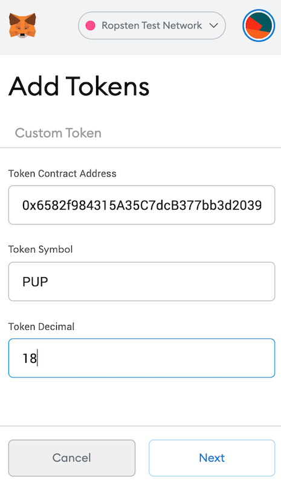

# HW-Solidity-Automated-CrowdSale

## Background
New startup has decided to crowdsale their PupperCoin token in order to help fund the network development. This network will be used to track the dog breeding activity across the globe in a decentralized way, and allow humans to track the genetic trail of their pets. Necessary legal bodies have been contacted and they have given the green light on creating a crowdsale open to the public. However, company is required to enable refunds if the crowdsale is successful and the goal is met, and it is only allowed to raise a maximum of 300 Ether. The crowdsale will run for 24 weeks.

ERC20 token should be created and will be minted through a Crowdsale contract that can leverage from the OpenZeppelin Solidity library.

This crowdsale contract will manage the entire process, allowing users to send ETH and get back PUP (PupperCoin). This contract will mint the tokens automatically and distribute them to buyers in one transaction.

It will need to inherit Crowdsale, CappedCrowdsale, TimedCrowdsale, RefundableCrowdsale, and MintedCrowdsale.

Crowdsale will be executed via Ropsten or Kovan Testnet in order to get a real-world pre-production testing.

## Instructions
Crowd-selling PupperCoin coded on Solidity to fund generic trailing project on pups. Two contracts need to be written and deployed on Remix : ``PupperCoin`` and ``PupperCoinCrowdsale``.

## Deployment step by step

Deploy the crowdsale contract to the Kovan or Ropsten testnet. Switch MetaMask to your desired network, and use the deploy tab in Remix to deploy your contracts. Take note of the total gas cost, and compare it to how costly it would be in reality.

It is important to follow the below steps (in this order) since this project was intended to fully automate the crowdsale. To do so we had to use two layers of contracts, a first contract deploying the two contracts (second layer) needed for a crowdsale which are : the Token contract (``PupperCoin.sol``) and the actual contract managing the crowdsale (``PupperCOinCrowdsale.sol``).

1. Open your MetaMask and change the network to your desired testnet - We used Ropsten. Make sure you pre-fund at least two addresses as you will need to use one address to deploy the contract (to pay the gas fee) and a second one to actually buy your crowdsale tokens to participate in the fundraising. 
2. Make sure you compile both main contracts/code : ``PupperCoin.sol`` and ``PupperCoinCrowdsale.sol``. 

3. Deploy the first contract = ``PupperCoinSaleDeployer`` (within ``PupperCoinCrowdsale.sol``). Fill in the parameters defined in the constructor code = ``name`` , ``symbol``, ``wallet``(will be the beneficiary address at the end of the crowdsale, if the goal is achieved) and the ``goal``(in this example we did set the goal at 2 ETH). 
Make sure you write down the two addresses created by this contract = ``token_sale_address`` and ``token_address``. 
This action costed us a total of 
``0.004774 ETH`` in gas fee.

showing the cost of the deployment : 

4. Deploy ``PupperCoinSale`` Contract by using the ``token_sale_address`` generated by the deployer contract in the __At_Address__ box i.e you are not deploying the contract directly as it has been already created by the deployer.This won't cost you any additional gas fee. 
5. Deploy `` PupperCoin`` contract following the same instruction but in this case using the contract address created by the deployer called : ``token_address``.  
   Note : don't forget to change the "contract to be deployed" in the dropdown list.

   

You can check that the actual contracts have been correctly deployed.  
*   PupperCoin

*   The CrowdSale contract managing the fundraising

## Transactions
1. Buy Tokens from our CrowdSale contract to raise funds - use a different address (hence don't forget to switch your MetaMask account)

1. Add the custom token ``PUP`` to your MetaMask to see teh new balance

2. The CrowdSale will be still be open as we did set it for 24 weeks but in our example we did reach our goal (2ETH) in one transaction as you can see in the below screenshots

Show how much we raised : 
   